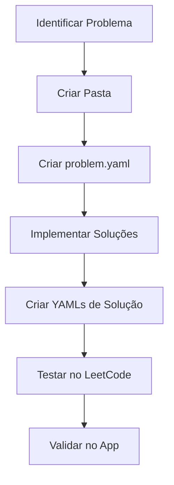

# 01 - Visão Geral do Projeto

## 📁 Estrutura de Diretórios

```
data/problems/
└── lc_{NÚMERO}_{SLUG}/
    ├── problem.yaml           # Definição completa do problema
    ├── code/                   # Arquivos de código fonte
    │   ├── sol_py_{approach}.py
    │   ├── sol_go_{approach}.go
    │   ├── sol_java_{approach}.java
    │   ├── sol_kotlin_{approach}.kt
    │   ├── sol_js_{approach}.js
    │   ├── sol_scala_{approach}.scala
    │   └── sol_rust_{approach}.rs
    └── solutions/              # Metadados das soluções (YAML)
        ├── sol_py_{approach}.yaml
        ├── sol_go_{approach}.yaml
        ├── sol_java_{approach}.yaml
        ├── sol_kotlin_{approach}.kt
        ├── sol_js_{approach}.yaml
        ├── sol_scala_{approach}.yaml
        └── sol_rust_{approach}.yaml
```

## 🏷️ Convenções de Nomenclatura

### Pasta do Problema
```
lc_{NÚMERO_4_DIGITOS}_{SLUG}
```
- **NÚMERO**: Número do problema no LeetCode com 4 dígitos (ex: `0001`, `0042`, `0121`)
- **SLUG**: Slug do problema em snake_case (ex: `two_sum`, `add_two_numbers`)

**Exemplos:**
```
lc_0001_two_sum
lc_0002_add_two_numbers
lc_0042_trapping_rain_water
lc_0121_best_time_to_buy_and_sell_stock
```

### Arquivos de Código
```
sol_{LANG}_{APPROACH}.{EXT}
```
- **LANG**: Abreviação da linguagem (`py`, `go`, `java`, `kotlin`, `js`, `scala`, `rust`)
- **APPROACH**: Abordagem principal (`hashmap`, `iterative`, `recursive`, `dp`, `twopointers`)
- **EXT**: Extensão apropriada (`.py`, `.go`, `.java`, `.kt`, `.js`, `.scala`, `.rs`)

**Exemplos:**
```
sol_py_hashmap.py
sol_go_iterative.go
sol_java_dp.java
sol_rust_twopointers.rs
```

## 📊 Linguagens e Paradigmas Suportados

| Linguagem | Abreviação | Extensão | Paradigma Principal |
|-----------|------------|----------|---------------------|
| Python | `py` | `.py` | Imperativo |
| Go | `go` | `.go` | Imperativo |
| Java | `java` | `.java` | OOP Clássico |
| Kotlin | `kotlin` | `.kt` | OOP Clássico |
| JavaScript | `js` | `.js` | OOP Prototype |
| Scala | `scala` | `.scala` | Funcional |
| Rust | `rust` | `.rs` | Funcional |

## 🔄 Fluxo de Criação de Problema



## 📝 Schema Version

Todos os arquivos YAML usam `schema_version: 3`.

## 🎯 Princípios de Design

1. **DRY (Don't Repeat Yourself)**: Reutilizar componentes e padrões
2. **SOLID**: Responsabilidade única por arquivo
3. **Consistência**: Mesma estrutura para todos os problemas
4. **Documentação**: Código autoexplicativo com comentários relevantes
5. **Testabilidade**: Código compatível com LeetCode sem modificações
